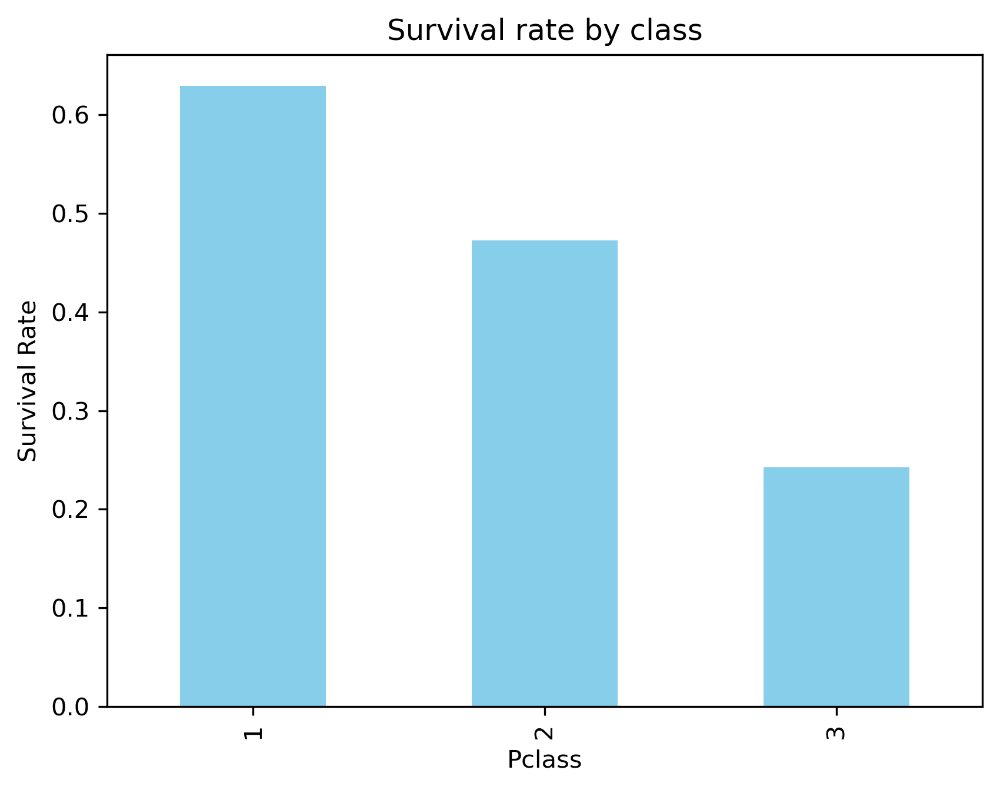
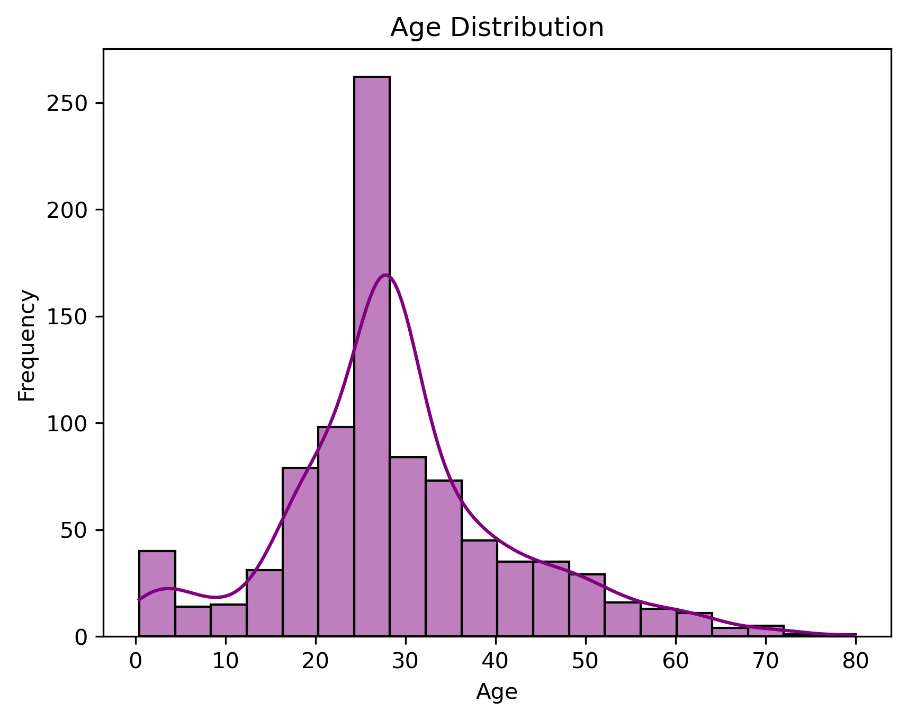
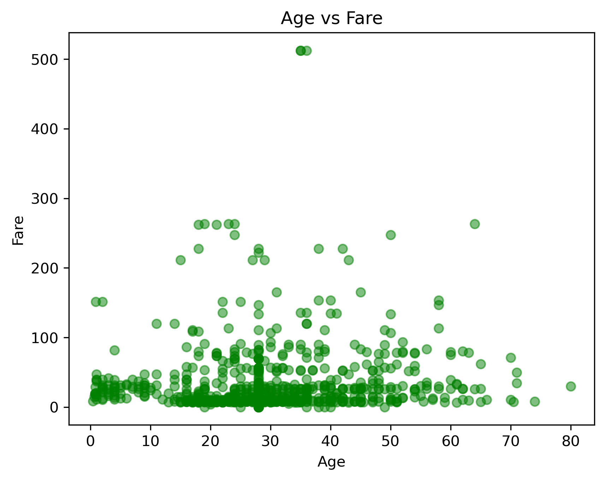

# Titanic Survival Analysis: An EDA Case Study

## Project Overview
This project performs a comprehensive Exploratory Data Analysis (EDA) on the famous Titanic dataset. As a pivot into **AI & Machine Learning**, the goal was to move beyond basic statistics and uncover the socioeconomic and feature-level correlations that determined passenger survival.

The analysis focuses on data cleaning, handling missing values via statistical imputation, and visualizing class-based disparities.

## Tech Stack
* **Python 3.9+**
* **Pandas & NumPy:** Data manipulation and cleaning
* **Seaborn & Matplotlib:** Statistical visualization

## Key Insights & Visualizations

### 1. The Socioeconomic Gap
Survival was not random. There is a distinct correlation between **Passenger Class (Pclass)** and survival rates. First-class passengers had a >60% chance of survival, while 3rd-class passengers dropped below 30%.



### 2. Age Demographics
The dataset skews young, with the majority of passengers aged between 20-40. Missing age values were handled using median imputation to preserve the distribution shape without introducing outliers.



### 3. The Price of Safety (Fare vs. Age)
A scatter analysis reveals a positive correlation between Fare price and survival, distinct from the age factor.



## How to Run
1.  Clone the repository:
    ```bash
    git clone [https://github.com/Nilcs2/Exploratory-Data-Analysis.git](https://github.com/Nilcs2/Exploratory-Data-Analysis.git)
    ```
2.  Install dependencies:
    ```bash
    pip install -r requirements.txt
    ```
3.  Launch the Jupyter Notebook:
    ```bash
    jupyter notebook "week2_proj/Exploratory_Data_Analysis.ipynb"
    ```

---
*Author: Nilesh Singh | Master's Student, Computer Engineering at SDSU*
